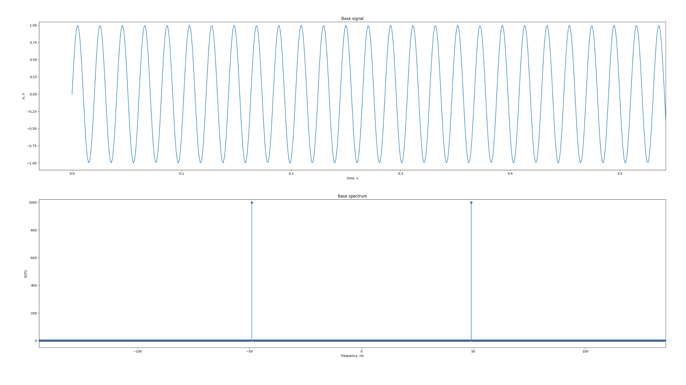
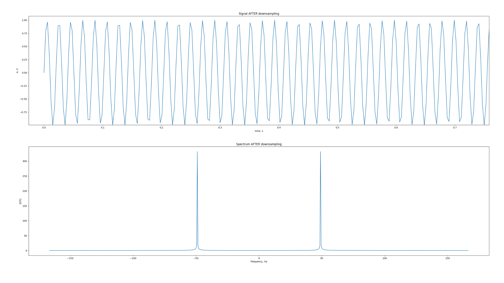
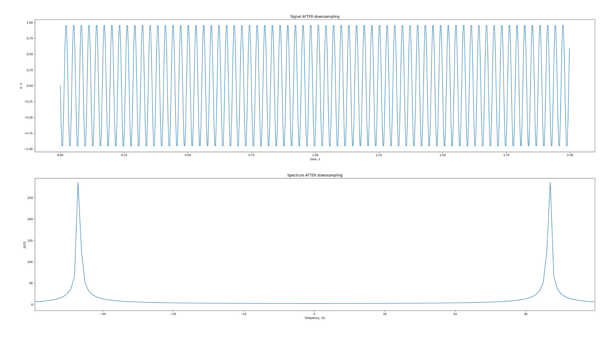
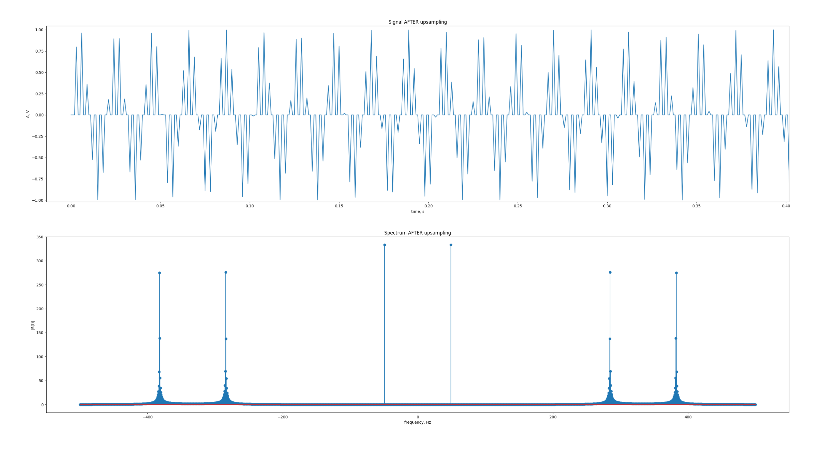
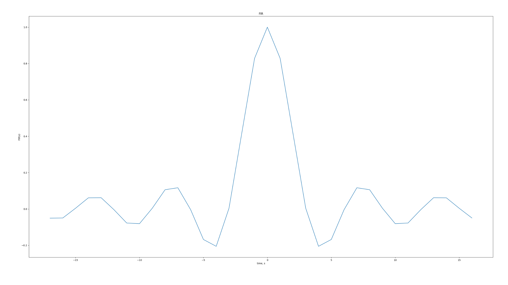
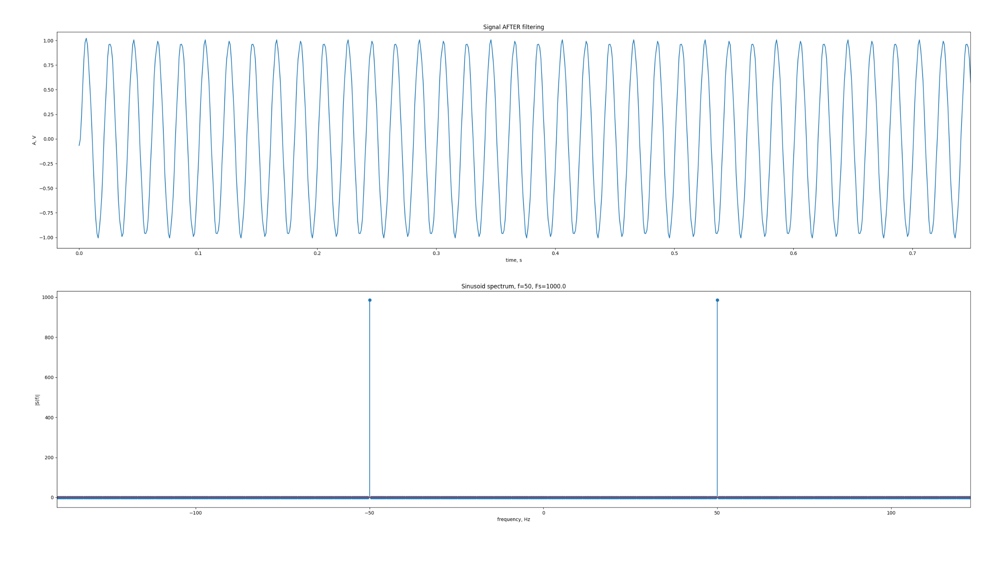
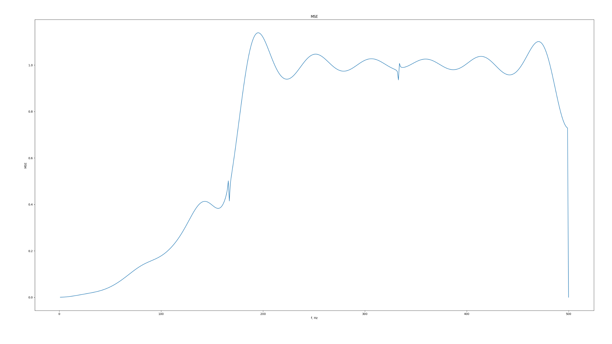

# Тестовое задание для Yadro Impulse 2026

## Запуск

```
python main.py
```

## Результаты работы

1. Сгенерируем синус на частоте 50Гц, отобразим его на графике в спектральной области и временной



Видим пик на частоте 50Гц, значит, сигнал корректный

2. Выполним понижение частоты дискретизации в 3 раза. Для этого возьмем из отсчетов сигнала, полученного на прошлом шаге, каждый третий отсчет. Визуализируем полученный сигнал во временной и спектральной области



Сигнал стал менее четкий (недостаток семплов), но при этом он является полностью корректным с точки зрения теоремы Котельникова. Если изначальная частота дискретизации составляла 1кГц, то после понижения в 3 раза она составит 333Гц. Такая частота дискретизации способна описать сигнал в 50Гц, но может получиться такая ситуация, что после понижения частоты дискретизации сигнал перестанет удовлетворять теореме Котельникова. 

Например, если бы была выбрана частота сигнала 300Гц, то сигнал бы уже не удовлетворял бы теореме Котельникова, и произошел бы aliasing, т.е мы получили бы какой-то другой сигнал. 




Данное явление можно наблюдать выше: мы подали на вход сигнал с частотой 300Гц, а получили сигнал с частотой 33Гц, т.е совершенно другой сигнал.

Таким образом можно сделать вывод, что можно понизить частоту дискретизации, если частота сигнала меньше как минимум вдвое меньше, чем пониженная частота дисретизации

$$2f \le \frac{F_s}{L}$$
здесь L - кол-во раз, в которое понижается/повышается частота дискретизации.

3. Выполним повышение частоты дискретизации в 3 раза путем добавления после каждого отсчета сигнала L-1 нулей, изобразим новый сигнал во временной и частотной области




Видим пики на 50Гц, а также лишние пики на 283Гц и 383Гц, которые остались от прошлого сигнала. Эти пики были и раньше, но они наблюдаются только после повышения частоты дискретизации, поскольку FFT окно расширилось. 

На данный момент мы имеем не тот сигнал, который хотелось бы, а какой-то другой. Нам нужно оставить только пики на 50Гц. Сделать это можно с помощью ФНЧ



Свернув сигнал с таким фильтром, получим сигнал без лишних пиков



Теперь сигнал полностью корректен, но всё-таки наблюдаются небольшие погрешности относительно начального сигнала. Это может быть связано с погрешностями в вычислениях или нехваткой отсчетов ФНЧ.

4. Оценка погрешности

Чтобы оценить погрешность, я вычислю MSE между полученнным сигналом и исходным для частот от 1Гц до 500Гц



Можно заметить, что резкий рост ошибки начинается примерно на 160Гц. Этот как раз примерно частота Найквиста для случая, когда мы понижаем частоту дискретизации в 3 раза (при условии, что начальная $F_s$ = 1кГц). Алиасинг вызывает рост ошибки.


